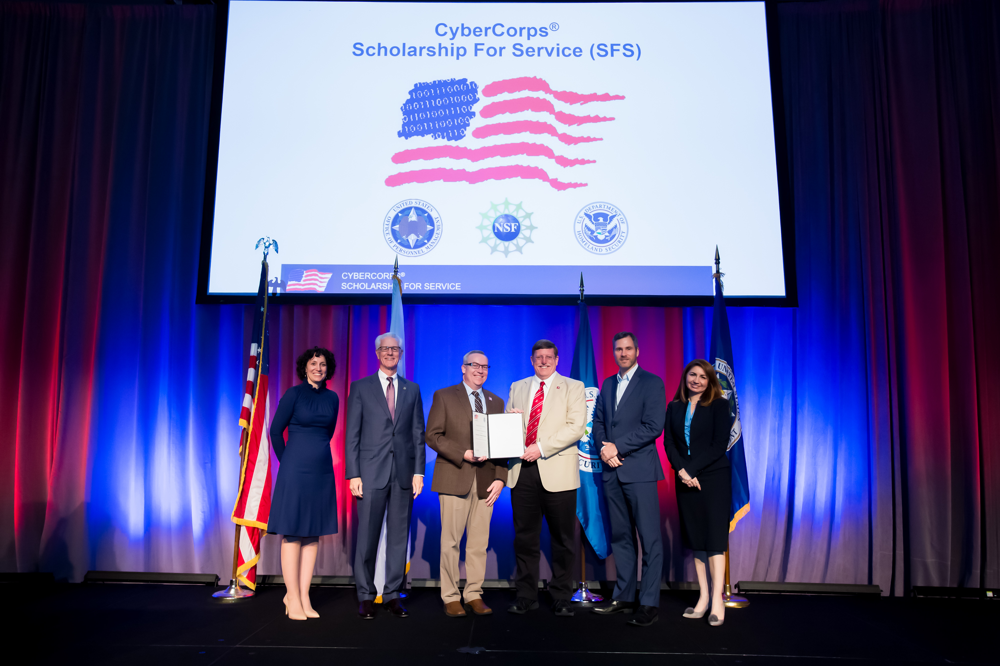

### Project PI

[Dr. Jeffrey Carver](http://carver.cs.ua.edu/), (205) 348-9829, [email](mailto:carver@cs.ua.edu)

### Program Contacts

* Dr. Travis Atkison, (205) 348-4740, [email](mailto:atkison@cs.ua.edu) - Computer Science and Cyber Security
* Dr. Adam Ghazi-Tehrani, (205) 348-7795, [email](mailto:aghazi@ua.edu) - Criminology and Criminal Justice
* Dr. Matthew Hudnall, (205) 348-0856, [email](mailto:matthew.hudnall@ua.edu) - Management Information Systems

**Pictured**: Karen A. Marrongelle (NSF), Dr. F. Fleming Crim (NSF), Dr. Jeffrey Carver (UA), Dr. Travis Atkison (UA), Mr. Bradford J. Willke (DHS), Ms. Veronica Villalobos (OPM)

**Not pictured**: Dr. Adam Ghazi-Tehrani (UA), Dr. Matthew Hudnall (UA), and Dr. Diana Dolliver (UA) [former Co-PI]
